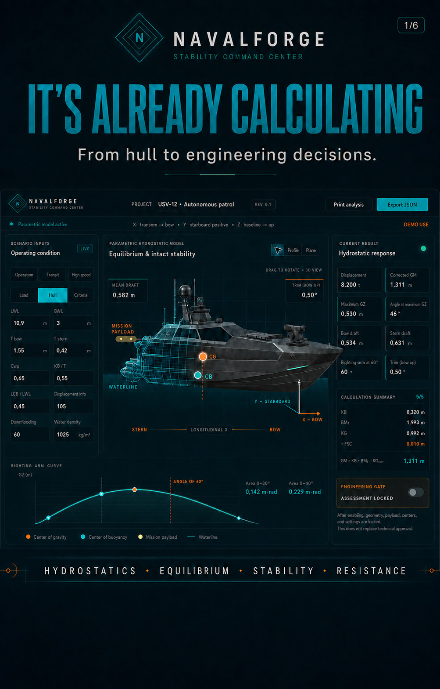
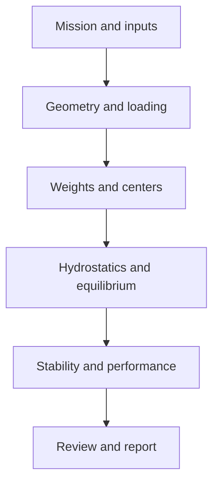

# NavalForge

**Engineering decision support for small high-speed craft.**

NavalForge is being developed to connect hull geometry, loading conditions, weights and centers, hydrostatic equilibrium, intact stability, resistance, planing performance, and technical reporting in one traceable workflow.

[Open the live Stability Command Center](https://navalforge-stability.eloy-engenheiro.chatgpt.site/)

## Public validation record

This repository records a controlled public demonstration of NavalForge using a fully synthetic 12 m unmanned surface vessel case. The published material demonstrates the current workflow without exposing production source code, proprietary hull geometry, customer information, or internal engineering evidence.

The demonstration covers:

- Weight breakdown and longitudinal centers
- Hydrostatic equilibrium, draft, and trim
- Intact-stability response and GZ assessment
- Resistance, required power, and planing estimates
- Comparison against an independent naval-design reference workflow

See the signed and dated [validation record](VALIDATION_RECORD.md), the [methodology](docs/VALIDATION_METHODOLOGY.md), and the complete [six-page validation gallery](docs/GALLERY.md).

## Repository scope

This public repository contains only:

- Synthetic demonstration material
- Product visuals and public documentation
- High-level architecture and validation methodology
- Publication safeguards and contribution rules

It intentionally excludes production source code, customer or partner identifiers, real vessel particulars, native CAD geometry, commercial material, bids, field-trial evidence, and internal simulation cases.

## Engineering workflow

## Important limitation

NavalForge is an engineering decision-support platform under active development. Public demonstrations and comparison results do not constitute vessel certification, class approval, regulatory approval, or a substitute for professional engineering review.

## Ownership

Copyright © 2026 Eloy Carvalho. All rights reserved. Public access to this repository does not grant permission to copy, modify, distribute, reverse engineer, or commercially use its contents. See [LICENSE](LICENSE).
